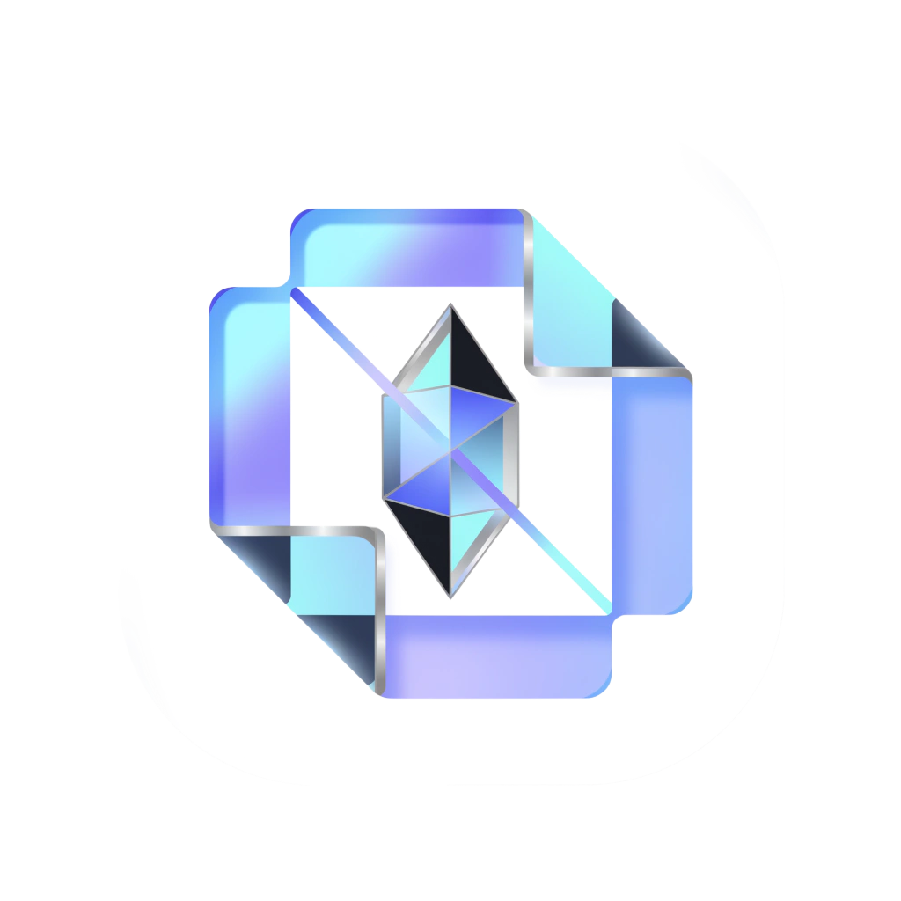

<div align="center">
  
  <h1>Nexora</h1>
  <p><strong>Enterprise Intelligent Invoice & Accounts Payable ERP (BYOK Edition)</strong></p>
  <p>
    <a href="https://nexora-ap.vercel.app"><strong>🌐 Launch Live Production App: https://nexora-ap.vercel.app</strong></a>
  </p>
</div>

[](https://nexora-ap.vercel.app)
[](https://github.com/OneforAll-Deku/Nexora-)
[](https://nextjs.org/)
[](https://fastapi.tiangolo.com/)
[](https://python.org/)
[](https://aistudio.google.com/)
[](https://cloudflare.com/)

> 🚀 **Live Production URL**: [https://nexora-ap.vercel.app](https://nexora-ap.vercel.app)  
> 🔗 **Alternative Mirrors**: [https://nexora-invoices.vercel.app](https://nexora-invoices.vercel.app) • [https://nexora-ai-erp.vercel.app](https://nexora-ai-erp.vercel.app)

An enterprise-grade, zero-cost-to-host accounts payable and document intelligence platform. Powered by **Bring-Your-Own-Key (BYOK) Google Gemini AI** and **OpenRouter open-source models**, statistical $Z$-score unit-price surge auditing, duplicate invoice detection, arithmetic sanity checks, an interactive split-screen reconciliation workspace, and multi-tab Excel/CSV/PDF remittance export engines.

---

## Table of Contents

1. [Executive Overview & Vision](#1-executive-overview--vision)
2. [Core Architecture & Zero-Cost Philosophy](#2-core-architecture--zero-cost-philosophy)
3. [Key Platform Features](#3-key-platform-features)
4. [Brand Identity & App Icon Design Specification](#4-brand-identity--app-icon-design-specification)
   - [Etymology & Brand Essence](#etymology--brand-essence)
   - [Core Visual Metaphors](#core-visual-metaphors)
   - [Brand Color System & Tokens](#brand-color-system--tokens)
   - [Icon Geometry & Composition Guidelines](#icon-geometry--composition-guidelines)
   - [Ready-to-Use AI Icon Prompts (Midjourney / DALL-E / Recraft)](#ready-to-use-ai-icon-prompts)
   - [Export Specification Matrix](#export-specification-matrix)
5. [Tech Stack](#5-tech-stack)
6. [Getting Started & Local Development](#6-getting-started--local-development)
7. [Automated Test Suite](#7-automated-test-suite)

---

## 1. Executive Overview & Vision

Traditional enterprise invoice processing (SAP Concur, Coupa, Bill.com) suffers from three fatal flaws:
1. **Hefty SaaS Subscriptions**: Enterprise platforms charge tens of thousands per year plus per-user seat licenses.
2. **Brittle Legacy OCR**: Traditional OCR engines require rigid, per-vendor bounding-box templates that break whenever an invoice layout or font alters slightly.
3. **Undetected Vendor Fraud & Price Creep**: Standard accounts payable software fails to cross-reference historical line-item unit prices against current charges, allowing silent margin leakage and billing discrepancies.

**Nexora solves this completely**:
- **Zero Software Subscription**: Operates under a **Bring-Your-Own-Key (BYOK)** model. Connect a free Google AI Studio key (1,500 free requests/day) or OpenRouter API key.
- **Multimodal AI Vision Extraction**: Raw document scans, mobile camera receipts, and distorted PDFs are parsed directly via vision tokens with strict Pydantic JSON schema validation.
- **Statistical Fraud & Surge Protection**: Automatically audits invoices for mathematical errors, duplicate billings, and $Z$-score unit-price surges against historical vendor baselines.

---

## 2. Core Architecture & Zero-Cost Philosophy

```
  ┌─────────────────┐       Direct Stream        ┌─────────────────────────┐
  │ PDF / Image /   │ ─────────────────────────> │   Cloudflare R2 Bucket  │
  │ Receipt Dropped │                            │  (Zero-Egress Storage)  │
  └────────┬────────┘                            └────────────┬────────────┘
           │                                                  │
           ▼                                                  ▼
  ┌────────────────────────────────────────────────────────────────────────┐
  │                           Nexora FastAPI Core                          │
  ├────────────────────────┬─────────────────────────┬─────────────────────┤
  │    BYOK Key Vault      │   Multimodal AI Vision  │ Statistical Auditor │
  │   (AES-128 Fernet)     │  Gemini 2.5 / OpenRouter│   ($Z \ge 2.5\sigma$)   │
  └────────────────────────┴────────────┬────────────┴─────────────────────┘
                                        │
                                        ▼
  ┌────────────────────────────────────────────────────────────────────────┐
  │                      Interactive Reconciliation ERP                    │
  │  Split-Screen Viewer • Real-Time Math Recalc • Multi-Tab Excel / PDF   │
  └────────────────────────────────────────────────────────────────────────┘
```

- **Zero Storage Egress Fees**: Documents are stored using Cloudflare R2 object storage compatible with S3 APIs with \$0 egress charges.
- **Client-Side & At-Rest Encryption**: API keys are encrypted at rest using AES-Fernet (AES-128 CBC + HMAC SHA256) and never stored in plaintext.
- **Zero Data Retention**: AI model queries operate via Google AI Studio API and OpenRouter zero-retention developer privacy policies.

---

## 3. Key Platform Features

### FR-1: BYOK Key Vault & Multi-Model AI Gateway
- **Dual-Provider Architecture**: Toggle seamlessly between **Google Gemini (AI Studio)** and **OpenRouter AI (Open-Source Models)**.
- **Dynamic Google Gemini Model Catalog**:
  - `gemini-2.5-flash`: Next-gen multimodal reasoning model (Recommended / 1,500 req/day free).
  - `gemini-2.5-flash-lite`: Sub-second latency for high-concurrency accounting queues.
  - `gemini-2.0-flash`: Production-hardened multimodal vision workhorse.
  - `gemini-1.5-flash`: Proven 1M token context window for dense multidimensional ledgers.
  - `gemini-2.5-pro`: Deep reasoning engine for complex tables and faint handwriting.
- **Live Google API Model Discovery**: 1-click **"Fetch Live Models (API)"** button queries `https://generativelanguage.googleapis.com/v1beta/models` to discover newly published Google checkpoints in real time.
- **Custom Model ID Registration**: Add experimental preview checkpoints (`gemini-2.5-flash-preview`, custom fine-tunes) directly from the UI.
- **Top Open-Source Models via OpenRouter**:
  - `meta-llama/llama-3.3-70b-instruct`
  - `qwen/qwen-2.5-vl-72b-instruct` (Multimodal Vision)
  - `deepseek/deepseek-chat` (DeepSeek V3)
  - `deepseek/deepseek-r1` (Reasoning Engine)
  - `mistralai/mistral-small-24b-instruct-2501`

### FR-2: Batch Staging Queue & Presigned Uploads
- High-density drag-and-drop zone supporting multi-file batches (`.pdf`, `.png`, `.jpg`, `.jpeg`, `.tiff`).
- Real-time staging queue with byte size, status pills, and animated progress bars.
- Built-in **1-Click Test Presets**:
  - *Clean Invoice*: Standard compliant SaaS subscription invoice.
  - *Arithmetic Mismatch*: Flags \$100 calculation discrepancy.
  - *Price Surge*: Flags +74.5% pallet shipping rate increase ($Z = 17.9\sigma$).
  - *Duplicate Submission*: Flags pre-existing invoice numbers.

### FR-3: Multimodal Extraction Pipeline
- Sends high-resolution inline document buffers directly to the selected vision model.
- Enforces strict Pydantic financial schemas: Vendor, Tax ID, Invoice #, Invoice Date, Due Date, Currency, Subtotal, Tax Amount, Grand Total, Payment Terms, and Line Item arrays.
- Automatic fallback to deterministic heuristic parser if no external API key is supplied.

### FR-4: Automated Fraud, Duplicate & Anomaly Engine
- **Arithmetic Sanity Audit**:
  $$\Delta = \left| \left(\sum \text{items} + \text{tax}\right) - \text{total}\right| > \$0.05$$
  Flags `ARITHMETIC_MISMATCH` with exact monetary discrepancy values.
- **Duplicate Invoice Detection**:
  Cross-checks incoming `(vendor_name, invoice_number)` against historical general ledger entries.
- **Statistical $Z$-Score Price Surge Protection**:
  $$Z = \frac{\text{Price} - \mu}{\sigma} \ge 2.5\sigma$$
  Maintains historical price distributions per vendor SKU to alert controllers before erroneous or inflated invoices are disbursed.

### FR-5: Split-Screen Reconciliation Workspace
- **Left Pane (Document Viewer)**: Interactive canvas supporting $50\% - 300\%$ zoom, smooth panning, $90^\circ$ rotation steps, and a high-contrast inverted luminance toggle.
- **Right Pane (Audited Ledger Form)**: Real-time recalculation of item totals, subtotal, and tax. Soft-amber and soft-red discrepancy banners highlight offending items.
- **Instant Approval Workflow**: Click "Approve & Commit to Ledger" to sync audited records into the permanent accounting book.

### FR-6: Accounting Export Engine
- **Multi-Tab Excel (.xlsx) via ExcelJS**: Formatted tabs for *Invoice Summary*, *Line Items Breakdown*, and *Fraud & Anomalies*.
- **QuickBooks & Xero Compatible CSV via PapaParse**: Clean CSV schema ready for ERP ingest.
- **Printable PDF Remittance Slips**: Formatted payment vouchers with vendor details, line items, and signature approval blocks.

---

## 4. Brand Identity & Official Icon Design

<div align="center">
  
  <p><em>The Official Nexora Mark: Frosted Origami Ledger "N" with Multimodal Neural Prism & Laser Ray</em></p>
</div>

*The official app icon, favicon, and brand emblem for the Nexora Intelligent ERP platform.*

```
   ┌─────────────────────────────────────────────────────────────┐
   │                     NEXORA ICON DESIGN                      │
   │                                                             │
   │        Layered Glass Documents   +   Neural Light Prism     │
   │               (Invoices & Ledgers)       (AI Vision & Math) │
   │                                                             │
   │            ┌───────┐                                        │
   │           ╱       ╱│   ▲                                    │
   │          ┌───────┐ │  ╱█╲   Laser Scan Beam                 │
   │          │       │ ┼ ╱███╲  Precision & Integrity           │
   │          │ Nexora│╱  ╲███╱                                  │
   │          └───────┘    ▼                                     │
   │                                                             │
   │           Colors: Obsidian • Electric Iris • Mint Green     │
   └─────────────────────────────────────────────────────────────┘
```

### Etymology & Brand Essence
- **Name**: **Nexora** (`/nɛkˈsɔːrə/`)
- **Roots**:
  - *Nexus* (Latin for connection, central focal point, data junction).
  - *Aurora* (Luminous clarity, illuminating dark financial records).
  - *Oracle* (Authoritative mathematical truth, fraud auditing).
- **Brand Personality**: High-precision, transparent, impenetrable, autonomous, minimal, modern luxury enterprise.

### Core Visual Metaphors

When designing the Nexora icon, synthesize these 3 primary concepts:
1. **Cascading Translucent Documents (The Ledger)**:
   - Floating, multi-tiered document planes or layered paper sheets.
   - Represents batch invoice processing, receipts, and structured financial data.
2. **The Neural Optical Prism (The Intelligence)**:
   - A sharp, crystalline prism, diamond, or angled aperture slicing through the document planes.
   - Represents multimodal AI vision and mathematical certainty (refracting raw chaos into structured clarity).
3. **The Precision Laser / Security Ray (The Audit)**:
   - An ultra-fine neon beam of electric indigo or emerald mint light illuminating discrepancies and verifying fraud protection ($Z$-Score detection).

---

### Brand Color System & Tokens

Use these exact hex codes and gradients when rendering vectors or raster icon assets:

| Token Name | Hex Code | RGB | Purpose & Symbolism |
| :--- | :--- | :--- | :--- |
| **Obsidian Dark** | `#090A0F` | `rgb(9, 10, 15)` | Primary canvas, dark-mode background, titanium frame |
| **Deep Charcoal** | `#12151E` | `rgb(18, 21, 30)` | Inner shadow, subtle bevel, card surface |
| **Electric Iris / Indigo** | `#6366F1` | `rgb(99, 102, 241)` | Primary brand accent, AI vision beam, intelligence glow |
| **Deep Violet** | `#4F46E5` | `rgb(79, 70, 229)` | Primary gradient transition, high-contrast accents |
| **Security Mint** | `#10B981` | `rgb(16, 185, 129)` | Verification, zero-cost freedom, clean audits, status |
| **Pure Light / Ice** | `#FFFFFF` | `rgb(255, 255, 255)` | Specular highlights, edge glints, typography |
| **Subtle Slate** | `#94A3B8` | `rgb(148, 163, 184)` | Secondary geometry, grid guides, muted text |

#### Recommended Gradients
- **Primary AI Beam**: `linear-gradient(135deg, #6366F1 0%, #4F46E5 50%, #10B981 100%)`
- **Obsidian Plate**: `linear-gradient(180deg, #161925 0%, #090A0F 100%)`
- **Frosted Glass Shard**: `linear-gradient(135deg, rgba(255,255,255,0.22) 0%, rgba(255,255,255,0.03) 100%)`

---

### Icon Geometry & Composition Guidelines

1. **Outer Silhouette**:
   - Continuous-curvature squircle (Apple macOS / iOS squircle formula: $n \approx 4.5$ or corner radius $\approx 22.5\%$).
   - Subtle $1\text{px}$ metallic titanium bezel (`#2E3346` to `#181B26`) with a gentle top specular highlight.
2. **Internal Structure**:
   - **Angle**: $30^\circ$ or $45^\circ$ isometric projection or centered orthogonal glyph.
   - **Form**: 3 stepped translucent frosted-glass sheets forming an ascending staircase or isometric cube, bisected by a sharp vertical light prism.
   - **Depth**: Soft ambient occlusion underneath the glass layers with a luminous colored core reflecting onto the dark base plate.
3. **Negative Space**:
   - Keep at least $18\% - 20\%$ padding around the central glyph inside the squircle boundaries.
   - Ensure the icon remains instantly recognizable at small sizes ($16\times 16$ favicon or $32\times 32$ menu bar icon).

---

### Ready-to-Use AI Icon Prompts

Copy and paste these prompts directly into Midjourney v6, DALL-E 3, Recraft.ai, or Stable Diffusion XL to generate the Nexora app icon:

#### Concept A: Layered Frosted-Glass Prism (Recommended Primary Icon)
> **Prompt**:  
> `A premium modern macOS app icon for "Nexora", an enterprise AI invoice ERP platform. Centered geometric icon inside a continuous rounded squircle container. The central emblem features three isometric layered translucent frosted-glass financial document sheets intersecting with a sharp glowing prism. A vibrant laser ray of electric indigo (#6366F1) and emerald mint (#10B981) radiates through the glass layers. Sleek deep obsidian background (#090A0F), subtle brushed titanium rim, clean studio caustics, minimal high-end Apple design award aesthetic, 3D vector-rendered, 8k resolution, photorealistic glass dispersion, no text. --ar 1:1 --v 6.0`

#### Concept B: Minimalist Geometric Monogram ("N" Folded Invoice Mark)
> **Prompt**:  
> `Minimalist modern corporate app icon for "Nexora". The logo is a stylized geometric capital letter "N" formed from an origami folded financial paper ledger and an illuminated laser prism. Flat-edge glassmorphism with subtle gradient from electric indigo to security green. Centered on a dark charcoal squircle icon tile, smooth metallic edges, clean vector lines, Dribbble trending, Figma icon style, high contrast, clean negative space. --ar 1:1 --v 6.0`

#### Concept C: FinTech Security & Audit Shield Emblem
> **Prompt**:  
> `Sleek high-tech software app icon for an enterprise accounting fraud detection engine. Centered inside a dark rounded squircle tile. A futuristic faceted shield motif merged with an invoice page, with an ultra-thin glowing laser beam scanning across the surface. Deep dark obsidian background, emerald mint and violet-cyan edge highlights, frosted glass transparency, elegant, professional, luxury fintech branding. --ar 1:1 --v 6.0`

---

### Export Specification Matrix

When exporting the final icon assets for production, generate the following package:

| Asset File | Resolution | Target Usage |
| :--- | :--- | :--- |
| `favicon.ico` | Multi (16x16, 32x32, 48x48) | Browser tab bookmark icon |
| `icon-192.png` | $192 \times 192\text{ px}$ | PWA manifest, Android web clip |
| `icon-512.png` | $512 \times 512\text{ px}$ | PWA splash screen, App Stores |
| `apple-touch-icon.png`| $180 \times 180\text{ px}$ | iOS Safari Home Screen icon |
| `app-icon.icns` | Multi ($16\text{px}$ to $1024\text{px}$) | macOS desktop application wrapper |
| `app-icon.ico` | Multi ($16\text{px}$ to $256\text{px}$) | Windows desktop application wrapper |
| `nexora-logo.svg` | Scalable Vector | Platform navigation header & brand kit |

---

## 5. Tech Stack

- **Frontend**: Next.js 15 (App Router), React 19, TypeScript, Vanilla Tailwind CSS.
- **Iconography & UI**: Lucide Icons, Instrument Serif & Inter typography.
- **Backend API**: FastAPI, Uvicorn, Pydantic v2, Requests.
- **AI Vision Providers**:
  - Google AI Studio (Gemini 2.5 Flash, 2.5 Flash-Lite, 2.0 Flash, 1.5 Flash, 2.5 Pro).
  - OpenRouter AI (Llama 3.3 70B, Qwen 2.5 VL, DeepSeek V3/R1).
- **Security**: Cryptography (AES-Fernet 128-bit CBC + HMAC SHA256).
- **Accounting Export Engine**: ExcelJS, PapaParse, Native HTML5 Canvas Print.

---

## 6. Getting Started & Local Development

### Prerequisites
- Node.js 18.x or 20.x+
- Python 3.10 or 3.11+

### 1. Start FastAPI Backend
```bash
cd backend
python -m pip install -r requirements.txt
python -m uvicorn app.main:app --host 127.0.0.1 --port 8000 --reload
```
- API Docs: [http://127.0.0.1:8000/docs](http://127.0.0.1:8000/docs)
- Health Check: [http://127.0.0.1:8000/health](http://127.0.0.1:8000/health)

### 2. Start Next.js Frontend
```bash
cd frontend
npm install
npm run dev
```
- Web Application: [http://localhost:3000](http://localhost:3000)
- BYOK Key Vault & Model Gateway: [http://localhost:3000/settings](http://localhost:3000/settings)
- Batch Ingestion Queue: [http://localhost:3000/staging](http://localhost:3000/staging)
- Fraud & Price Surge Hub: [http://localhost:3000/anomalies](http://localhost:3000/anomalies)

---

## 7. Automated Test Suite

Run the full pytest suite:
```bash
pytest backend/test_backend.py -v
```

Validated test cases:
1. `test_fernet_encryption_and_masking`: Confirms AES-Fernet encryption/decryption roundtrip and deterministic key masking (`AIzaSy••••••2345`).
2. `test_arithmetic_sanity_check`: Confirms exact catch of mathematical mismatches ($\Delta > \$0.05$).
3. `test_duplicate_submission_detection`: Prevents replay billing of identical vendor invoice numbers.
4. `test_price_surge_z_score_detection`: Validates statistical outlier alerts when unit prices spike $> 2.5\sigma$ over historical vendor baselines.
5. `test_openrouter_models_catalog_and_key_handling`: Verifies OpenRouter model registry and pre-flight validation.
6. `test_gemini_models_catalog_and_selection`: Validates Google Gemini model catalog, free-tier flag verification, and key handling.

---

*Nexora © 2026. Zero-Cost Autonomous Financial Intelligence.*
